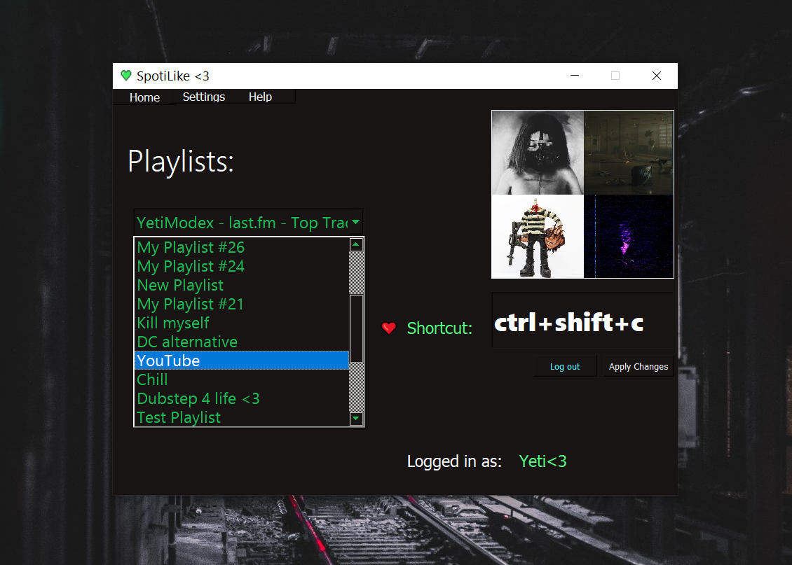
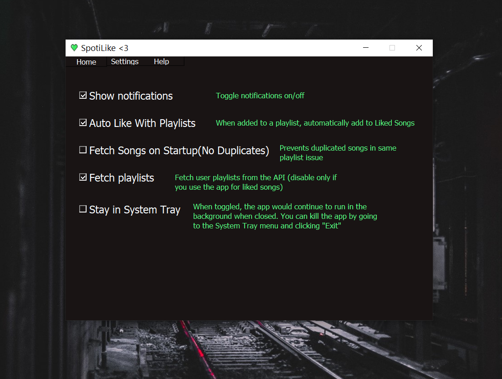
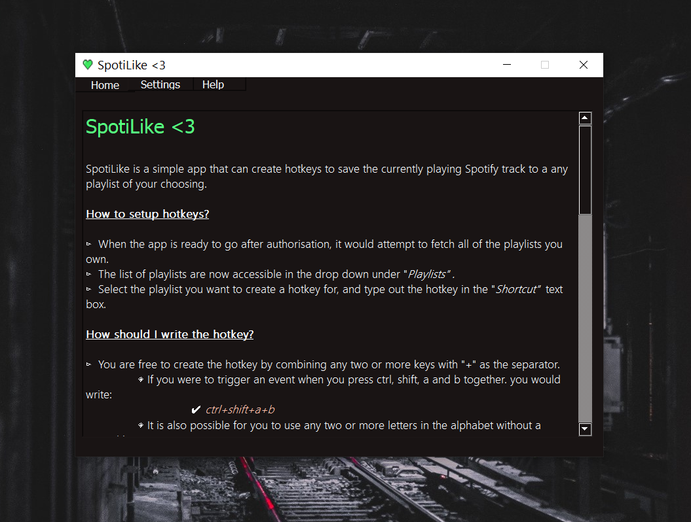

<div align="center">


</div>

# SpotiLike-GUI

Save Spotify songs on-the-go while you're listening to your Liked Songs library or your favorite playlists with custom hotkeys!

This app lets you have a custom hotkey linked to one of your custom playlists in Spotify that would take the current song you're listening to, and put that on the playlist for you. This allows you **not** have to re-open Spotify to like/save a song. I wrote this simple script because I found it annoying that I had to re-open Spotify just to save a song that I liked. I did not want to interrupt my workflow but at the same time didn't want to miss a cool track either!

## Screenshots


<br>

<br>


## Usage & Installation

> A simple guide on how to use the app is placed in the '`help`' tab within the app itself.

You can grab the [latest release here](https://github.com/senuka-b/SpotiLike-GUI/releases/latest).

1. Download the `SpotiLike.zip` archive.
2. EXtract it to wherever you want.
3. Run the `SpotiLike.exe` file.

If you want the application to run whenever you start up Windows. Refer to [this guide here](https://support.microsoft.com/en-us/windows/add-an-app-to-run-automatically-at-startup-in-windows-10-150da165-dcd9-7230-517b-cf3c295d89dd).

## Bundling the app yourself

I used the package `cx_Freeze` to bundle the app for the [release](https://github.com/senuka-b/SpotiLike-GUI/releases/latest).

You can find the setup file in `src/setup.py` .

1. Clone the repo

2. Run `pip install -r requirements.txt`

3. Move into the `src` directory and then run:


    ```
    $ python setup.py build
    ```

The application uses PKCE authorization so there is no need for a client secret. You can run the application or make changes to it at your own will.

## How it works

The workflow of the app is simple.

1. Authorises the user with PKCE

2. Attempts to fetch all playlists
    - All the playlist pictures / icons of these playlists are automatically downloaded named by the playlist's ID

    - This is done in every boot, therefore newly created playlists would automatically be added unless you choose to disable this option.

3. When the user enters a hotkey, it attempts to match the typed word to the most suitable _existing_ key

4. Then it formats the key to a suitable format of which `pynput.GlobalHotKey` accepts

5. The hotkey thread runs in the background globally

## Library requirements:

* **pynput** - for handling keyboard events

* **PyQT5** - GUI

* **spotipy** - handling Spotify data

* **fuzzywuzzy** - match inputted hotkey strings 

___

## Leave a star ⭐!

If you found the concept behind this app useful, please make sure you leave a star on the repo! Thanks!